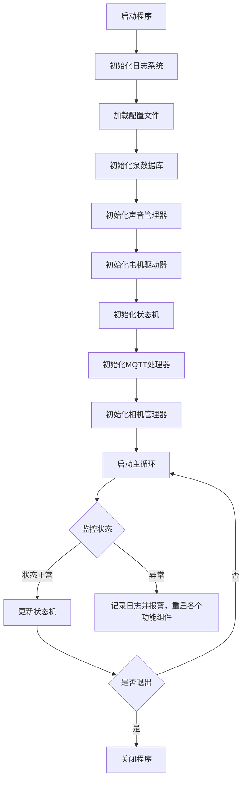
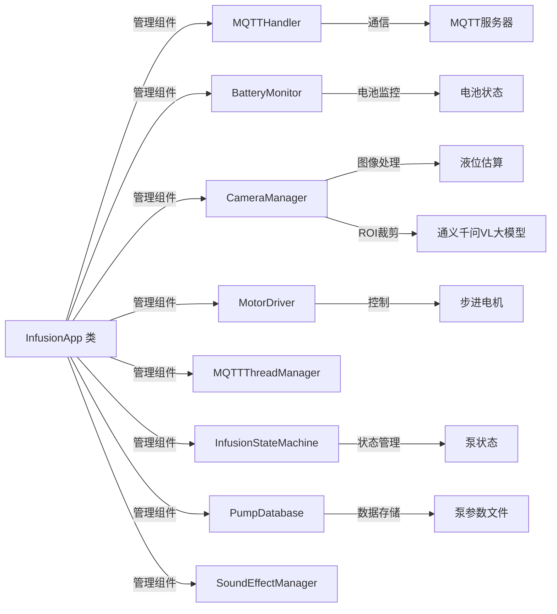
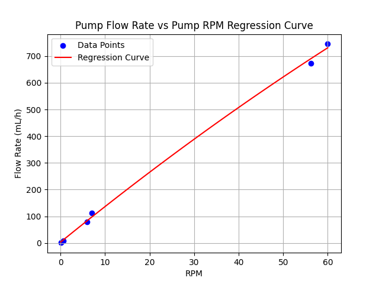

## 四、软件设计

### 平台与开发工具
本项目基于树莓派平台，主要使用以下开发工具：
- **编程语言**：C++ 和 Python
- **开发环境**：Ubuntu 24.04 LTS on ARM64
- **IDE**：VSCode Remote SSH环境、CMake、Clion、Github Copilot、Git
- **图像处理**：OpenCV
- **物联网中间件**：ThingsBoard
- **大模型推理**：通义千问VL
- **通信协议**：MQTT、UART、HTTPS 和 NFC

### 实现方法

系统采用模块化设计，核心由 `InfusionApp` 类统一管理各功能组件。程序启动后，依次初始化日志系统、配置文件、泵数据库、声音管理器、电机驱动器、状态机、MQTT 处理器和相机管理器，随后进入主循环，实时监控系统状态。

- **电机控制**：通过树莓派的 GPIO 和 PWM 接口驱动步进电机（DRV8825），实现精确的液体输送。`MotorDriver` 组件负责电机启停与转速调节，配合状态机实现恒流量控制和紧急停止。
- **用户界面**：采用 ThingsBoard 仪表盘作为前端界面，用户可通过网页或移动端远程访问和操作输液器。仪表盘实时显示流量、液量、报警等关键信息，并支持启停控制、流量设定、报警确认等操作。所有数据通过安全的 MQTT 协议与树莓派后端同步，实现远程监控和管理，便于医护人员集中管理多台设备，提高工作效率和安全性。
- **液量估算**：`CameraManager` 组件通过摄像头采集液位图像，结合 OpenCV 进行图像处理和液位识别，必要时调用大模型（通义千问VL）进行输液瓶位置辨识，裁剪出ROI区域，提升识别精度，实现液量显示与报警。
- **NFC 认证**：集成 PN532 NFC 模块，基于`thirdparty/pn532` Linux串口开源库，负责读取液瓶和输液者身份信息，防止误用。
- **物联网功能**：`MQTTHandler` 组件负责与远程服务器通信，实现数据上报、远程监控和群体控制，支持安全协议防止未授权访问。
- **异常处理**：系统主循环持续监控各模块状态，异常时自动记录日志、报警并重启相关功能组件，确保系统稳定运行。

整体架构如程序框图所示，各功能模块协同工作，实现自动排空气、恒流量控制、液量监测、报警、NFC 认证和物联网远程管理等智能输液功能。

### 程序流程方框图

### 程序框架图

### 各部分功能模块介绍
本节详细介绍智能输液器系统的核心功能模块及其协作方式，帮助读者理解整体架构如何实现自动化、智能化和远程管理。

#### 原子操作在系统流程中的应用

为确保系统的稳定性和数据一致性，智能输液器各功能模块在关键流程中广泛采用原子操作。原子操作指的是在执行过程中不可被中断的最小操作单元，常用于多线程或多进程环境下的数据同步、状态切换和资源管理。系统通过原子操作实现如下目标：

- **状态切换的原子性**：如状态机（InfusionStateMachine）在切换“运行”与“报警”状态时，采用互斥锁（mutex）或原子变量，确保状态变更过程不会被其他线程打断，避免竞态条件。
- **参数更新的原子性**：泵数据库（PumpDatabase）和电机驱动器（MotorDriver）在更新泵参数、流量设定等关键数据时，采用原子写入操作，防止数据读写冲突，保证参数一致性。
- **消息通信的原子性**：MQTT Handler 在收发消息、处理远程RPC指令时，采用消息队列和原子操作，确保每条指令完整处理，避免丢包或重复执行。
- **异常处理的原子性**：主循环在检测到异常（如低液位、设备故障）时，采用原子操作触发报警、日志记录和模块重启，确保异常响应的及时性和唯一性。
- **图像采集与处理的原子性**：相机管理器（CameraManager）在采集图像和更新液量数据时，采用原子操作锁定数据缓冲区，防止并发访问导致数据不一致。

#### 各功能模块简介

##### 泵数据库（PumpDatabase）
泵数据库负责管理所有支持型号的泵参数，并使用二次回归算法进行泵转速与预期流量的转换，是系统精确控制流量和适配不同泵型的基础。系统启动时，`PumpDatabase` 类会自动加载本地泵参数文件，校验配置的泵名称是否存在，并为电机驱动等模块提供实时计算、参数查询的接口。

**主要流程：**
1. 加载泵参数文件，解析各型号参数。
2. 校验当前泵型号是否支持。
3. 提供参数接口供电机驱动、状态机等模块调用。
4. 根据泵型号和设定流量计算所需转速。

##### 声音管理器（SoundEffectManager）
声音管理器用于提升用户交互体验，通过音效提示系统状态变化。`SoundEffectManager` 类在系统初始化时加载音频设备和音效资源，支持播放如启动、关闭、报警等多种音效。模块设计支持异步播放，确保主流程不被阻塞。

**主要流程：**
1. 初始化音频设备，加载音效文件。
2. 在系统启动、关闭或报警时触发相应音效。
3. 支持扩展更多提示音类型。

##### 电机驱动器（MotorDriver）
电机驱动器是实现精确输液的核心模块。通过配置树莓派的 GPIO 和 PWM 接口，`MotorDriver` 类可控制步进电机的启停、转速调节和紧急停止。该模块根据泵数据库提供的参数自动调整输出，确保流量精度，并支持异常情况下的紧急断电。

**主要流程：**
1. 初始化 GPIO、PWM 接口，检测电机状态。
2. 根据设定流量和泵参数实时调整转速（原子更新）。
3. 接收紧急停止指令，立即断开电机输出（原子操作）。

##### 状态机（InfusionStateMachine）
状态机模块负责管理输液器的各类运行状态（如待机、运行、报警、停止等），并协调各功能组件的行为。`InfusionStateMachine` 类支持状态切换、异常处理和状态恢复，确保系统在各种情况下都能安全、稳定运行。

**主要流程：**
1. 初始化状态机，设定初始状态。
2. 根据传感器和用户输入切换状态（原子切换）。
3. 处理异常，自动恢复或报警。

##### MQTT Handler
MQTT Handler 实现了与物联网平台的数据通信，是远程监控和群体控制的桥梁。`MQTTHandler` 类负责连接 MQTT 服务器，订阅/发布相关主题，实现泵状态、参数的实时上报和远程下发指令。支持断线重连和消息缓存，保证数据可靠传输。

**主要流程：**
1. 建立与 MQTT 服务器的连接。
2. 订阅控制主题，处理远程指令。
3. 定期上报泵状态、报警等信息。

##### RPC 调用
系统通过 MQTT 实现远程过程调用（RPC），支持远程修改泵参数、启停控制等操作。`MQTTHandler` 与 `InfusionStateMachine` 协同处理 RPC 请求，确保指令安全、及时响应。

**主要流程：**
1. 接收来自服务器的 RPC 请求。
2. 调用本地接口更新泵参数或状态。
3. 返回执行结果，反馈操作状态。

##### 相机管理器（CameraManager）
相机管理器集成摄像头与图像处理算法，实现液位自动识别和报警。`CameraManager` 类负责摄像头初始化、图像采集，并结合 OpenCV 及大模型（如通义千问VL）进行液位检测。识别结果用于实时液量显示和低液位报警，极大提升安全性和自动化水平。

**主要流程：**
1. 初始化摄像头，定时采集液位图像。
2. 利用 OpenCV 处理图像，识别液面高度。
3. 必要时调用大模型提升识别精度，触发报警或更新液量显示。

---

各模块通过统一的 `InfusionApp` 类进行管理，模块间通过接口协作，既保证了系统的高内聚、低耦合，也便于后续功能扩展和维护。原子操作的广泛应用确保了系统流程的安全性和一致性，整体设计兼顾了实时性、可靠性和可扩展性，是智能输液器实现自动化与远程管理的基础。

### 实现功能列表
  - 自动排空气
  - 输液启停控制
  - 恒流量输液控制
  - 基于大模型视觉的液量显示及报警
  - 紧急停止功能
  - 物联网前端访问及群体控制
  - NFC液瓶及输液者身份认证

## 五、系统测试

### 泵流量-泵转速回归曲线
以下为系统实际测试的泵流量-泵转速回归数据：

| 流量 (mL/h) | 转速 (RPM) |
| ------------ | ----------- |
| 745.34       | 60.0        |
| 674.16       | 56.2        |
| 111.34       | 7.0         |
| 78.26        | 6.0         |
| 7.5          | 0.6         |
| 0.76         | 0.06        |

回归得到：
$$Q = -0.02393 \cdot n^2 + 13.57313 \cdot n + 3.09303$$

其中，$Q$ 表示流量（mL/h），$n$ 表示转速（RPM）。

### 回归效果测试
根据回归数据，给定目标泵流量300 mL/h，运行600秒，实际放出液量为52 mL，误差为4%，符合设计范围（±10%）。

#### 测试数据记录
| 测试项目       | 目标值       | 实际值       | 误差       | 设计范围 |
| -------------- | ------------ | ------------ | ---------- | -------- |
| 泵流量         | 300 mL/h     | 52 mL/600s   | 4%         | ±10%     |
| 液量测量误差   | -            | ±4%          | -          | ±10%     |

#### 实验结果分析
实验结果表明，系统的流量控制精度和液量测量误差均满足设计要求，验证了智能输液器的可靠性和稳定性。
