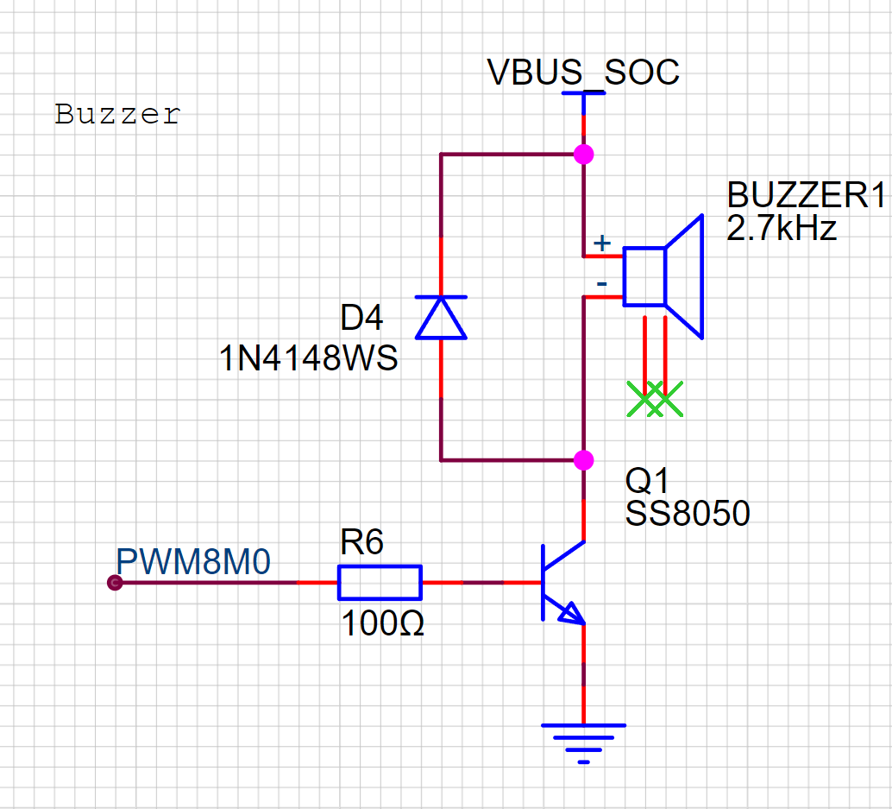

# 智能输液瓶技术方案

## 1. 系统框图

核心电路包括：树莓派：主控制器，处理控制逻辑和通信。
- 步进电机驱动：使用DRV8825，连接树莓派GPIO控制泵电机。
- HDMI显示：1024x768触摸屏显示器，结合LVGL库实现界面。NFC模块：PN532读卡器，读取液瓶NFC标签。
- 摄像头：如Raspberry Pi Camera Module，用于液位估算。实现方式为将各模块通过树莓派集成，软件通过Python或C++开发，驱动电机、读取传感器数据并显示。

选型：
| 设备         | 型号                            |
| ------------ | ------------------------------- |
| 树莓派       | 树莓派5                         |
| 步进电机驱动 | DRV8825                         |
| 蜂鸣器报警   | 5V无源蜂鸣器                    |
| BMS          | BQ40Z50 + 21700电池，4s, 5V输出 |
| NFC模块      | PN532                           |
| 摄像头       | Raspberry Pi Camera Module      |

BOM清单：
| 设备                                          | 数量 |
| --------------------------------------------- | ---- |
| 树莓派5 8G                                    | 1    |
| 自制步进电机驱动/蜂鸣器告警/NFC载板综合开发板 | 1    |
| 微雪树莓派5 UPS(E) with 21700                 | 1    |
| HDMI 1024x1080 显示                           | 1    |
| NFC模块 PN532                                 | 1    |
| 4K摄像头                                      | 1    |
| 高精度蠕动输液泵+步进电机                     | 1    |

框图：

## 2. Workflow
### 1. PCB硬件绘制
#### 目的
为了实现智能输液器的电机驱动功能，需要设计一块硬件板，用于连接树莓派、步进电机驱动、NFC模块、蜂鸣器。
#### 输入输出
- 参考文档：
  - 树莓派40Pin GPIO定义
  - DRV8825驱动芯片手册
  - PN532模块手册
- 输入：
  - DRV8825：电机转向、步进、使能、细分选择
    - 电机端子：XH2.54-4P
    - 电机电源端子：(+-)KF129
  - PN532：UART通信 
    - 端子：GH1.25-4P
  
  打在`PCB丝印`上
  - 蜂鸣器：蜂鸣器报警
    - 三极管`NPN`驱动，连接到树莓派PWM GPIO
    - 参考供应商编号：`C94599`
  
  - RPI Pinout: [树莓派5 GPIO插座](https://www.raspberrypi.com/documentation/computers/raspberry-pi.html#gpio)
  
  | Pin | Name    | Description         |
  | --- | ------- | ------------------- |
  | 1   | 3.3V    | 3.3V Power          |
  | 2   | 5V      | 5V Power            |
  | 3   | SDA     | GPIO 2 BMS I2C SDA  |
  | 4   | 5V      | 5V Power            |
  | 5   | SCL     | GPIO 3 BMS I2C SCL  |
  | 6   | GND     | Ground              |
  | 9   | GND     | Ground              |
  | 36  | GPIO 16 | GPIO 16 细分控制I   |
  | 11  | GPIO 17 | GPIO 17 细分控制II  |
  | 38  | GPIO 20 | GPIO 20 细分控制III |
  | 35  | GPIO 19 | GPIO 19 步进PWM     |
  | 32  | GPIO 12 | GPIO 12 步进使能    |
  | 8   | TXD     | UART TX PN532 RX    |
  | 10  | RXD     | UART RX PN532 TX    |
  | 33  | GPIO 13 | GPIO 13 蜂鸣器PWM   |
  | 12  | GPIO 18 | GPIO 18 温度控制    |
    
- 注意：
  - UART TX和RX需要交叉
  - UART 电平转换（专用芯片） 树莓派3.3V，PN532 5V
#### 机械
- 尺寸：树莓派尺寸，树莓派开孔
  排针间距：2.54mm
  
  

### 2. 软件开发
#### 目的和工作拆分
- 目的：实现智能输液器的控制逻辑，包括启停控制、恒流量控制、液量显示、报警功能。同时实现NFC认证和物联网访问功能。还需要基于`OpenCV`实现液位估算。